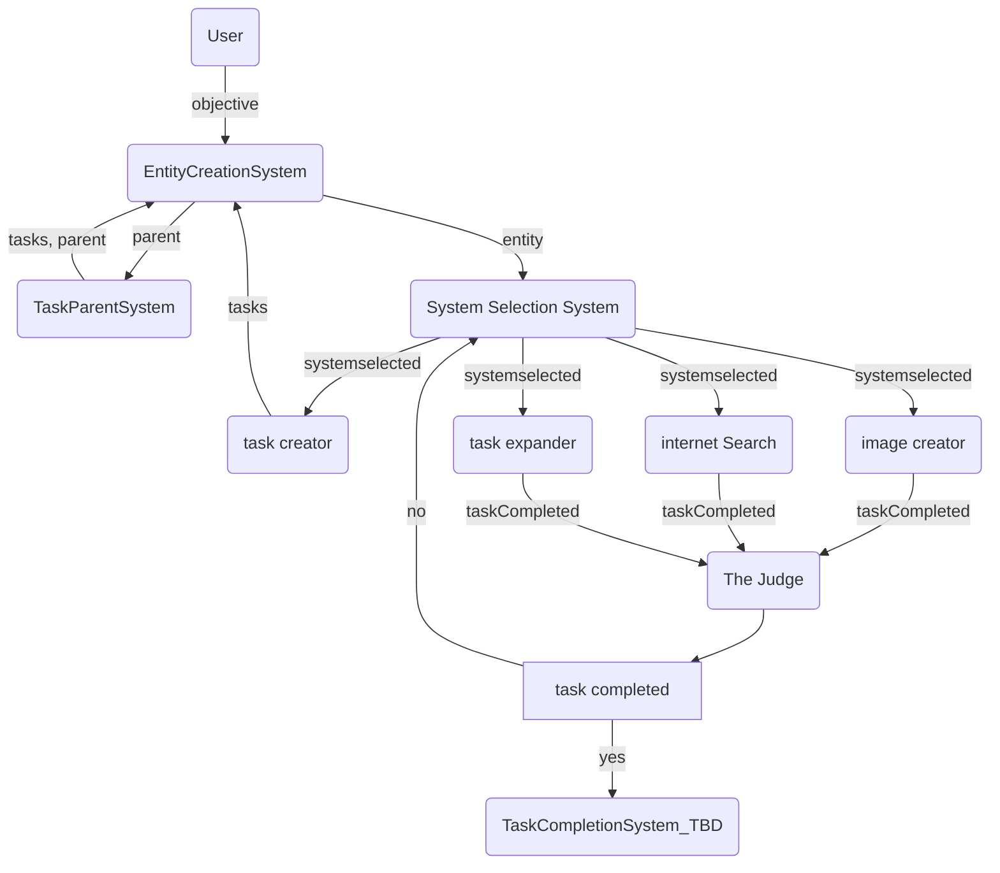
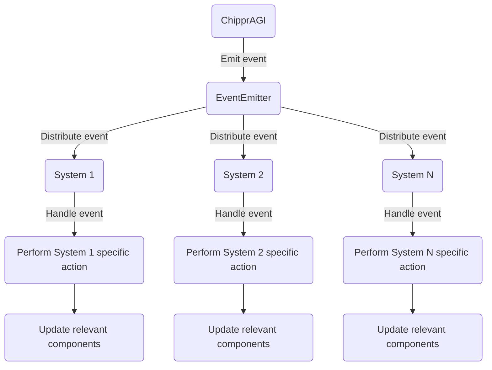

![You are a designer tasked with creating a simple, line art mascot for the Chippr-AGI open-source framework. The mascot should be a small robotic chipmunk with a single round eye. The chipmunk should have a rectangular body with rounded edges, and its limbs should be thin, straight lines. The tail should be a thin curved line, and the whole design should be in a single color of your choice. The mascot should convey the intelligence and efficiency of the software, while still being approachable and friendly. Once you have created the mascot, submit it as a PNG file with a transparent background.
](src/core/lib/splashLogo.png )

# Chippr-AGI

Chippr-AGI is an open-source event-driven ECS framework that uses AI models to automate task creation and prioritization. This system is designed to run solo or as a swarm of containers. It combines the power of GPT-4 with actor-critic reinforcement learning to optimize the order and allocation of tasks for a given objective.  

##### _This repo is under active development, clone often or use the latest docker image_
 
## Getting Started

### Simple Demo
- Clone the repository:` git clone https://github.com/chippr-robotics/chippr-agi.git`
- Install the dependencies: `yarn`
- Update your API keys docker-compose configuration located in `./docker/docker-compose.yml`
- Update the OBJECTIVE in `./examples/simple_demo.js` 
- Start redis (you can use docker-compose for this)
- Start the application: `yarn demo` 
- Monitor the vector DB at `http://localhost:8001`

#### Customize
Add systems and components to meet your needs then `yarn start`

### Docker( Easy )
#### Pull the Image

First, pull the Chippr-AGI Docker image from Docker Hub:
```
docker pull chipprbots/chippr-agi:latest
```

#### Run the Container

To run the Chippr-AGI container, you'll need to set up environment variables for your OpenAI API key and Redis credentials. Create a `.env` file by copying `.env.example`

Replace `CHIPPRAGI_LANGUAGE_MODEL_API_KEY`, `CHIPPRAGI_VECTORDB_HOST`, `CHIPPRAGI_VECTORDB_PORT`, and with your actual values.

Now, run the container with the following command:
```
docker run -d --name chippr-agi --env-file .env  chipprbots/chippr-agi:latest
```

This will start the Chippr-AGI container in detached mode and load the environment variables from the `.env` file.

### Docker-compose (Best)
#### Update the docker-compose.yml
Add the value for `CHIPPRAGI_LANGUAGE_MODEL_API_KEY` to the docker-compose.yml located in `./docker`
#### Create the Vector-DB and CHIPPRAGI services

```
docker-compose up
```


## Basic Flow
Chippr-AGI uses a combination of GPT-4 for generating task descriptions and actor-critic reinforcement learning to prioritize the tasks based on their estimated rewards. The framework is built using Node.js and Redis to store embeddings for quick query and update.

Tasks are generated based on the current context and objective, which are passed into a customizable prompt template. The prompts are stored in a JSON file and can be easily edited to fit specific needs. Once a task is generated, its dependencies are added to the task list and prioritized based on their estimated reward.

After a task is completed, the system checks if any new tasks need to be generated based on the success of the previous task. The process is repeated until all tasks are completed and the objective is achieved.

## System Flow

In this flowchart:

1) The objective is provided to the system by a user (see examples/simple-demo)
2) Tasks are stored as entities with associated components.
3) An event is emitted to addSystemSelection to the task, which is handled by the System Selection system.
4) We add a component to each entity mapping it to its parent objective
5) An event is emitted to addSystemSelected the task, which is handled by the system selection system.
6) The system selection system evaulates which loaded systems can best complete the task
7) An event is emitted identifying which system will process the task
8) The task is executed based on the relevant components.
9) The result of the task is stored, and the task is marked as done.
10) The system checks if the objective is complete.
11) If the objective is not complete, an event is emitted to generate new tasks, which is handled by the Task Generation system.

## ECS events
The ChipprAGI class emits an event using the EventEmitter.
The EventEmitter distributes the event to all registered systems.
Each system handles the event if it's relevant to that system.
The system performs its specific action based on the event and updates the relevant components.
This diagram shows a high-level overview of how events are propagated through the ChipprAGI system and how systems handle and react to events.



## Contributing
We welcome contributions from the community. If you'd like to contribute to Chippr-AGI, please fork the repository and submit a pull request. We recommend discussing your ideas with the community in the issues section before starting any major work.

## License
This project is licensed under the APACHE-2.0 License. See the LICENSE file for more details.