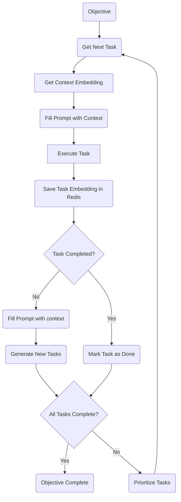

![You are a designer tasked with creating a simple, line art mascot for the Chippr-AGI open-source framework. The mascot should be a small robotic chipmunk with a single round eye. The chipmunk should have a rectangular body with rounded edges, and its limbs should be thin, straight lines. The tail should be a thin curved line, and the whole design should be in a single color of your choice. The mascot should convey the intelligence and efficiency of the software, while still being approachable and friendly. Once you have created the mascot, submit it as a PNG file with a transparent background.
](docs/chipprAGI.png )

# Chippr-AGI

Chippr-AGI is an open-source framework that uses AI models to automate task creation and prioritization. It combines the power of GPT-4 with actor-critic reinforcement learning to optimize the order and allocation of tasks for a given objective.

## How it works
Chippr-AGI uses a combination of GPT-4 for generating task descriptions and actor-critic reinforcement learning to prioritize the tasks based on their estimated rewards. The framework is built using Node.js and Redis to store embeddings for quick query and update.

Tasks are generated based on the current context and objective, which are passed into a customizable prompt template. The prompts are stored in a YAML file and can be easily edited to fit specific needs. Once a task is generated, its dependencies are added to the task list and prioritized based on their estimated reward.

After a task is completed, the system checks if any new tasks need to be generated based on the success of the previous task. The prioritization process is repeated until all tasks are completed and the objective is achieved.

## Getting Started
- Clone the repository:` git clone https://github.com/chippr-robotics/chippr-agi.git`
- Install the dependencies: `npm install`
- Create a `.env` file with your OpenAI API key and Redis credentials.
- Edit the `prompts.yaml` file to fit your specific needs.
- Start the application: `npm start`

## Contributing
We welcome contributions from the community. If you'd like to contribute to Chippr-AGI, please fork the repository and submit a pull request. We recommend discussing your ideas with the community in the issues section before starting any major work.

## License
This project is licensed under the APACHE-2.0 License. See the LICENSE file for more details.