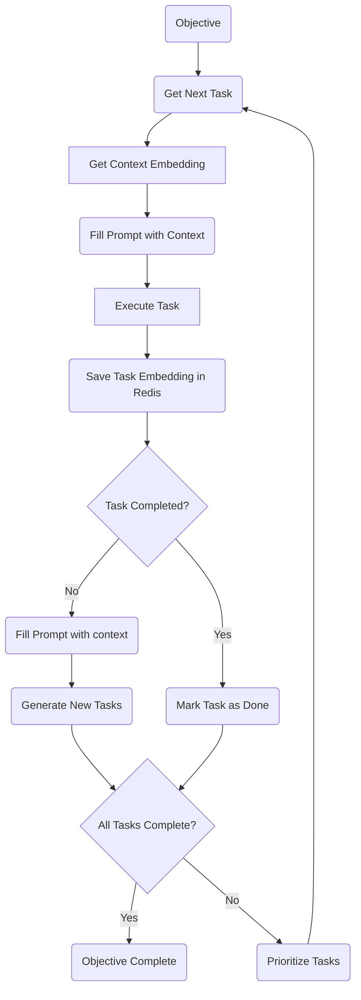

# chippr-agi
AGI using openai, redis, and gpt4

```mermaid
graph TD
  A(Objective) --> B(Get Next Task)
  B --> C[Get Context Embedding]
  C --> D(Fill Prompt with Context)
  D --> E[Execute Task]
  E --> N(Save Task Embedding in Redis)
  N --> F{Task Completed?}
  F -- Yes --> G(Mark Task as Done)
  F -- No --> H(Fill Prompt with context)
  H --> M(Generate New Tasks)
  M --> J{All Tasks Complete?}
  G --> J
  J -- Yes --> K(Objective Complete)
  J -- No --> L(Prioritize Tasks)
  L --> B
```
