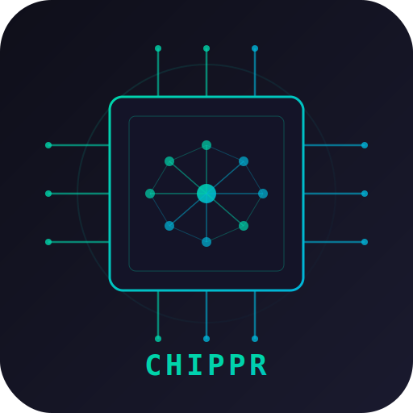

<p align="center">
  
</p>

<h1 align="center">chippr-agi v2</h1>

<p align="center">
  A modern TypeScript ECS agent framework.<br/>
  Ground-up rewrite of <a href="https://github.com/chippr-robotics/chippr-agi">chippr-robotics/chippr-agi</a>.
</p>

<p align="center">
  
  
  
  
</p>

---

## Why v2?

v1 served its purpose as a proof-of-concept BabyAGI-style loop. v2 is a ground-up rewrite with a clear thesis: **agent orchestration is an ECS problem**. Entities are tasks, components are data, systems are behaviors, and the event bus is the nervous system. The result is a framework that is auditable in an afternoon, composable by design, and genuinely useful for autonomous agent workflows.

## Features

### Entity-Component-System Core

Everything in chippr-agi is an **Entity** with **Components** attached to it. **Systems** subscribe to events on the bus and operate on entities. This architecture means you never subclass, you compose.

- Typed `EventBus` with wildcard subscriptions
- Persistent entities, components, and events in SQLite
- Self-registering systems loaded dynamically from `src/systems/`

### Dual Model Providers

- **Claude** (Anthropic API) as the primary reasoning engine with full tool-use and agent loop support
- **Local models** (Ollama, llama.cpp, BitNet) via OpenAI-compatible API for offline or cost-sensitive workloads

### Semantic Memory with Gemini Embeddings

The storage layer doubles as a vector database. Memories are embedded using **Google Gemini embedding models** and stored as BLOB vectors in SQLite. Semantic search uses cosine similarity to surface the most relevant memories.

- **Task-typed embeddings** — documents are embedded with `RETRIEVAL_DOCUMENT`, queries with `RETRIEVAL_QUERY`, improving retrieval accuracy
- **Configurable dimensionality** — tune the output vector size to balance precision vs. storage
- **Automatic or manual embedding** — `addMemoryEmbedded()` auto-embeds when a provider is configured, or store pre-computed vectors directly
- **Default model: `gemini-embedding-001`** — Google's production-grade embedding model

### Autonomous Systems

| System | Role |
|---|---|
| **SystemSelector** | Routes tasks to the most appropriate registered system using LLM tool-use |
| **TaskGenerator** | Breaks high-level objectives into discrete, actionable subtasks |
| **TheJudge** | Evaluates task completion with a score and reasoning |
| **Scheduler** | Runs tasks on cron schedules (`* * * * *` or `@every 30s`) |

### Container Isolation

Each agent context runs in an isolated container (Docker or Apple Container) with configurable mount paths, network access, and environment variables. No agent can escape its sandbox.

## Quick Start

```bash
# Clone and install
git clone https://github.com/chippr-robotics/chippr-agi.git
cd chippr-agi
npm install

# Configure
cp .env.example .env
# Edit .env with your API keys

# Run
npm start -- "Build a REST API for a todo app"
```

## Configuration

| Variable | Default | Description |
|---|---|---|
| `CHIPPR_MODEL_PROVIDER` | `claude` | `claude` or `local` |
| `CHIPPR_CLAUDE_MODEL` | `sonnet` | Claude model name |
| `ANTHROPIC_API_KEY` | — | Required for Claude provider |
| `CHIPPR_LOCAL_URL` | `http://localhost:11434/v1` | Local model API URL |
| `CHIPPR_LOCAL_MODEL` | `bitnet-b1.58` | Local model name |
| `CHIPPR_DB_PATH` | `./chippr.db` | SQLite database path |
| `GEMINI_API_KEY` | — | Enables Gemini embedding for semantic memory |
| `CHIPPR_GEMINI_EMBEDDING_MODEL` | `gemini-embedding-001` | Gemini embedding model |
| `CHIPPR_GEMINI_EMBEDDING_DIMENSIONS` | — | Output vector dimensionality |
| `CHIPPR_CONTAINER_RUNTIME` | `docker` | `docker` or `apple-container` |
| `CHIPPR_CONTAINER_IMAGE` | `chippr-agent:latest` | Agent container image |
| `CHIPPR_LOG_LEVEL` | `info` | `debug`, `info`, `warn`, `error` |

## Development

```bash
npm run dev     # Watch mode with tsx
npm test        # Vitest test suite
npm run build   # TypeScript compilation
```

## Architecture

```
src/
├── ecs/           # Engine, EventBus, type definitions
├── model/         # Claude, Local, and Gemini Embedding providers
├── store/         # SQLite persistence + vector search
├── systems/       # Self-registering ECS systems
├── container/     # Docker/Apple Container isolation
└── util/          # Config, logger, hash utilities
```

## Design Principles

1. **One opinion per concern** — no switch-statement abstractions
2. **Auditable in an afternoon** — target ≤600 lines core logic
3. **ECS is the skeleton** — everything is an Entity, Component, or System
4. **Container-first isolation** — each agent context runs sandboxed
5. **Skills over features** — extend via `.claude/skills/`, not merged PRs

## License

[Apache-2.0](LICENSE)
