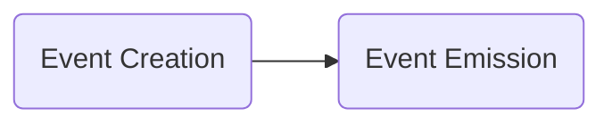
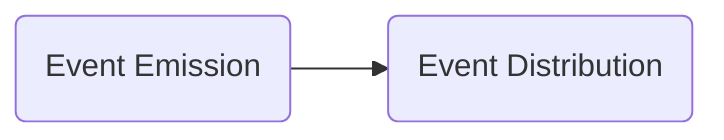
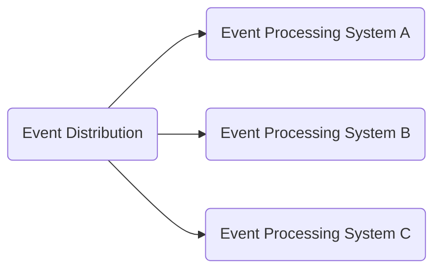
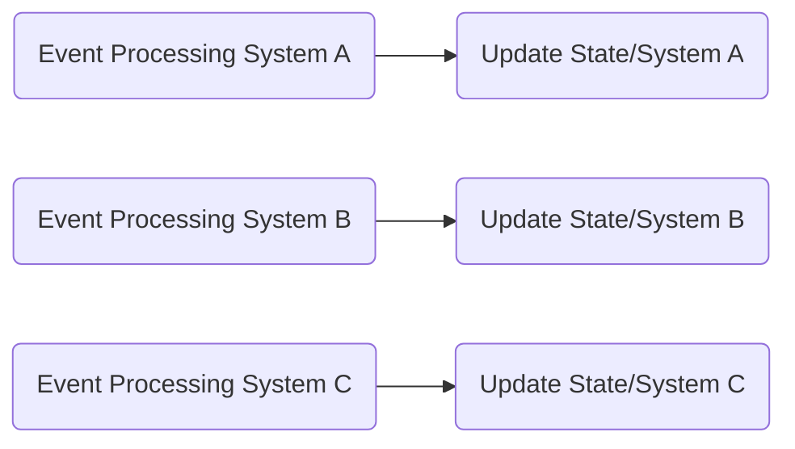

# Event-Driven Architecture in Chippr-AGI

Event-driven architecture is a design pattern that promotes loose coupling and effective communication between different parts of an application. In Chippr-AGI, this architecture is used to manage interactions between systems and components while maintaining a modular and scalable structure.

## The Basics of Event-Driven Architecture

In an event-driven architecture, events are the primary mechanism for communication between different parts of the application. An event is a message that represents something that has happened, such as a change in state or the completion of a task. Events are produced by one part of the application and consumed by another, often without any direct knowledge of each other's existence.

Here are the key aspects of event-driven architecture:

1. **Event Producers:** Components or systems that create and emit events when a specific action occurs or a state change happens.
2. **Event Consumers:** Components or systems that listen for and react to events, usually by performing a specific action or updating their internal state.
3. **Event Bus:** A central communication channel that allows events to be passed between producers and consumers without them needing to be directly connected.

## Life Cycle of an Event

The life cycle of an event in Chippr-AGI consists of the following stages:

1. **Event Creation:** An event is created by an event producer when a specific action occurs or a state change happens. The event contains relevant information about what has occurred, such as the entity ID or any additional data needed for processing.

2. **Event Emission:** The event producer emits the event, sending it to the event bus.

3. **Event Distribution:** The event bus distributes the event to all registered event consumers that have expressed interest in the specific event type. This allows multiple systems to react to the same event independently.

4. **Event Processing:** Event consumers process the event, performing actions or updating their internal state as needed. The event processing stage is usually asynchronous and can happen in parallel across multiple systems.

5. **Update State/System:** Once the event has been processed, the event consumer updates its internal state or performs other actions as necessary, completing the life cycle of the event.

By understanding the life cycle of events in Chippr-AGI, you can effectively manage communication between systems and components, ensuring that your application remains modular, scalable, and easy to maintain.