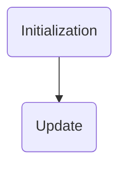
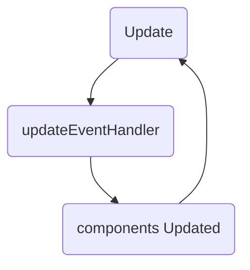

# Systems in Chippr-AGI

Systems in Chippr-AGI are the primary building blocks responsible for handling the logic and processing related to specific tasks or functionalities. They work in tandem with components to define the behavior of the application, forming a crucial part of the Entity-Component-System (ECS) architecture.

## Life Cycle of a System

The life cycle of a system in Chippr-AGI consists of several stages:

1. **Initialization:** The system is registered with the Chippr-AGI core using `CHIPPRAGI.registerSystem()`. The `init` function is called, allowing the system to set up event listeners or perform any necessary setup.

2. **Update:** As the application runs, the system listens for and processes events. When an event is received, the system's `update` function is called, allowing it to handle changes in component data or perform any required actions.

3. **Remove:** When a component or its associated entity is removed, the system's `remove` function is called, allowing it to clean up any resources or perform necessary actions.

4. **Tick:** The system's `tick` function is called on every scene tick or frame, providing an opportunity to perform any continuous or time-dependent actions.

## Purpose of Systems

Systems in Chippr-AGI serve the following purposes:

1. **Handle Events:** Systems listen for and process events related to their specific functionality, such as updating component data, performing calculations, or managing interactions between components.

2. **Encapsulate Logic:** Systems contain the logic required to perform tasks or manage specific parts of the application, keeping the code modular and easier to maintain.

3. **Interact with Components:** Systems work with components to define the behavior of entities, providing a dynamic and flexible way to manage application state.

## Differences Between Systems and Components

Systems and components are both essential parts of the ECS architecture, but they serve distinct roles:

1. **Systems** are responsible for processing logic, handling events, and managing interactions between components. They define the behavior and functionality of the application.

2. **Components** are data containers that store information about entities, such as properties or attributes. They do not contain any logic and are used to describe the state of an entity.

In Chippr-AGI, systems and components work together to create a modular and scalable application structure, allowing you to build complex applications with ease.