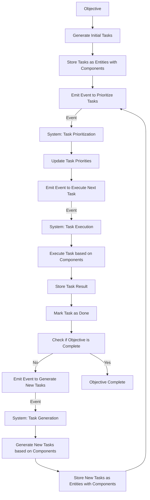

In this flowchart:

The objective is used to generate the initial tasks.
Tasks are stored as entities with associated components.
An event is emitted to prioritize tasks, which is handled by the Task Prioritization system.
Task priorities are updated based on the system's logic.
An event is emitted to execute the next task, which is handled by the Task Execution system.
The task is executed based on the relevant components.
The result of the task is stored, and the task is marked as done.
The system checks if the objective is complete.
If the objective is not complete, an event is emitted to generate new tasks, which is handled by the Task Generation system.
New tasks are generated based on the components and the previous task's result.
The new tasks are stored as entities with components, and the process repeats from step 3.