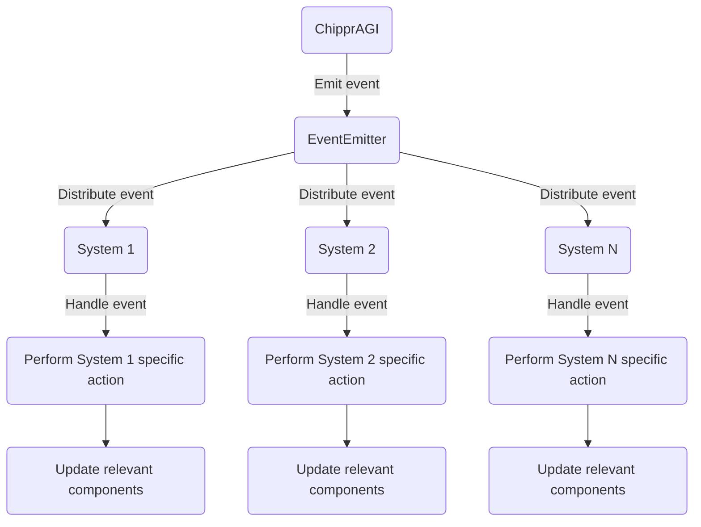

The ChipprAGI class emits an event using the EventEmitter.
The EventEmitter distributes the event to all registered systems.
Each system handles the event if it's relevant to that system.
The system performs its specific action based on the event and updates the relevant components.
This diagram shows a high-level overview of how events are propagated through the ChipprAGI system and how systems handle and react to events.