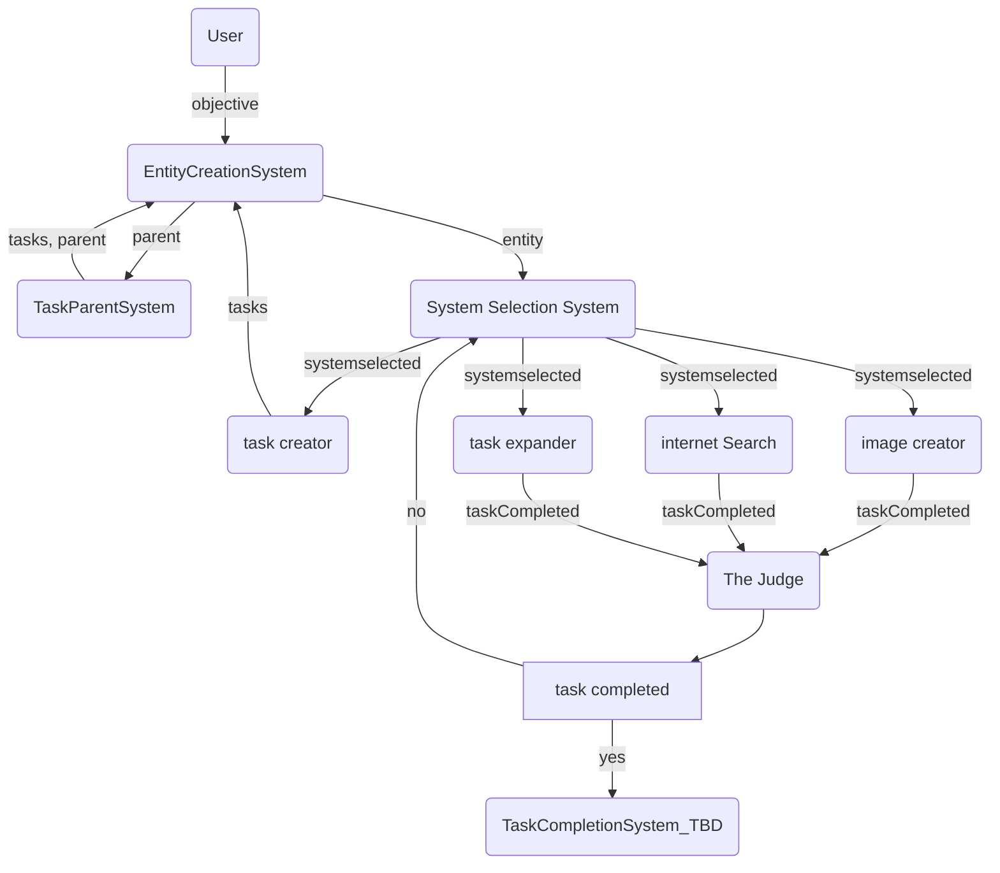
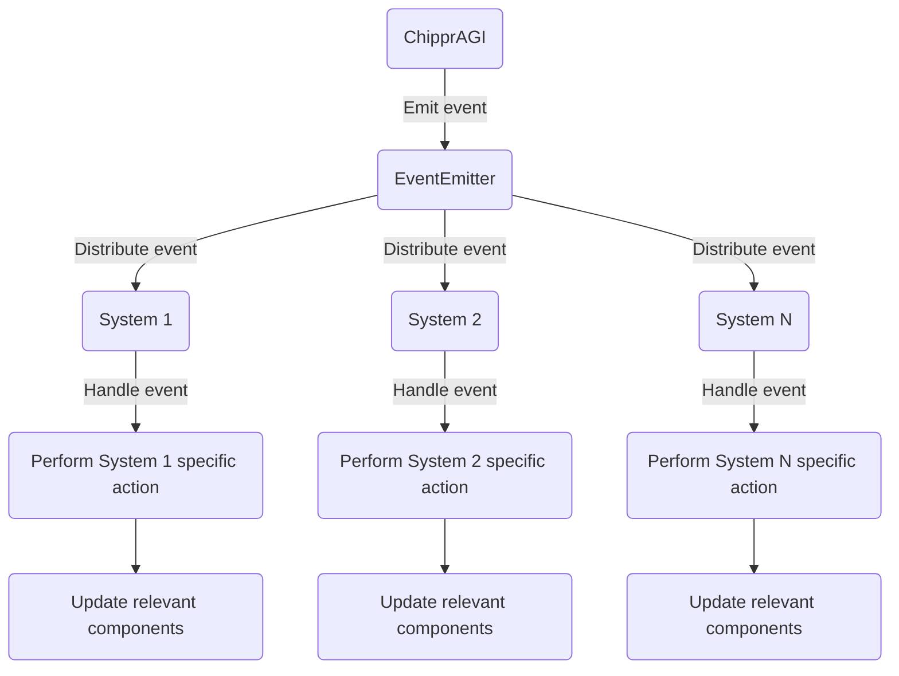

## Basic Flow
Chippr-AGI uses a combination of LLMs for generating task descriptions and actor-critic reinforcement learning to prioritize the tasks based on their estimated rewards. The framework is built using Node.js and Redis to store embeddings for quick query and update.

Tasks are generated based on the current context and objective, which are passed into a customizable prompt template. The prompts are stored in a JSON file and can be easily edited to fit specific needs. Once a task is generated, its dependencies are added to the task list and prioritized based on their estimated reward.

After a task is completed, the system checks if any new tasks need to be generated based on the success of the previous task. The process is repeated until all tasks are completed and the objective is achieved.

## System Flow

In this flowchart:

1) The objective is provided to the system by a user (see examples/simple-demo)
2) Tasks are stored as entities with associated components.
3) An event is emitted to addSystemSelection to the task, which is handled by the System Selection system.
4) We add a component to each entity mapping it to its parent objective
5) An event is emitted to addSystemSelected the task, which is handled by the system selection system.
6) The system selection system evaulates which loaded systems can best complete the task
7) An event is emitted identifying which system will process the task
8) The task is executed based on the relevant components.
9) The result of the task is stored, and the task is marked as done.
10) The system checks if the objective is complete.
11) If the objective is not complete, an event is emitted to generate new tasks, which is handled by the Task Generation system.

## ECS events
The ChipprAGI class emits an event using the EventEmitter.
The EventEmitter distributes the event to all registered systems.
Each system handles the event if it's relevant to that system.
The system performs its specific action based on the event and updates the relevant components.
This diagram shows a high-level overview of how events are propagated through the ChipprAGI system and how systems handle and react to events.

## Contributing
We welcome contributions from the community. If you'd like to contribute to Chippr-AGI, please fork the repository and submit a pull request. We recommend discussing your ideas with the community in the issues section before starting any major work.

## License
This project is licensed under the APACHE-2.0 License. See the LICENSE file for more details.